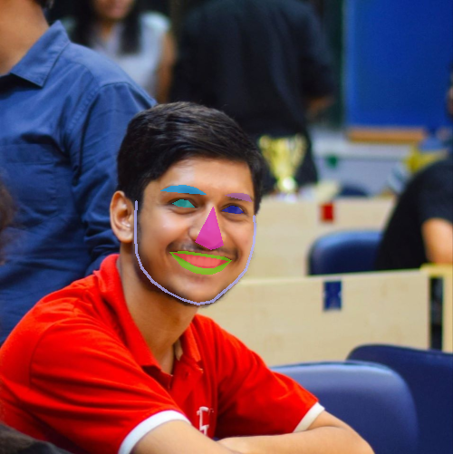

# Replicate-Mouse-with-Facial-Actions

This project is done by:
Sindhu Pawar : GitHub -> sindhu-2507
Aniruddha Chidar : GitHub -> AniruddhaChidar

The project aims at replicating the mouse action using facial keypoints in live video stream.
The actions include left click (by winking left eye), right click (by winking right eye) and moving
the mouse pointer (by tracking the nose tip).

We used OpenCV to achieve face detection and Dlib for facial keypoints extraction.

The results are shown below:

Original Image:
 

  
<!--    -->

Keypoints Extraction:

  
<!--    -->

Enveloping the areas:

  
<!--    -->

